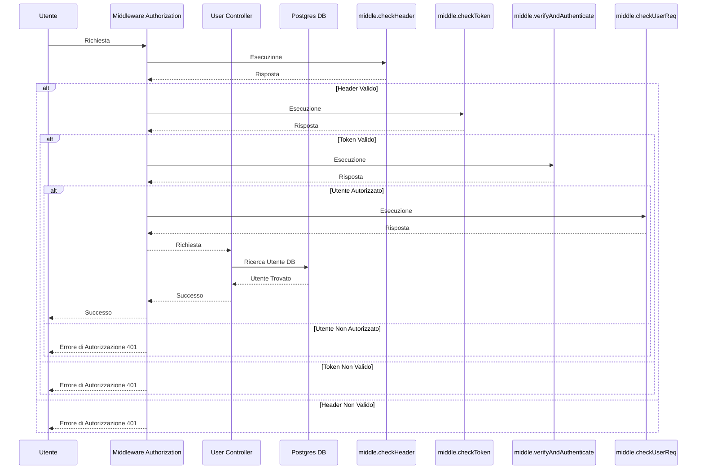
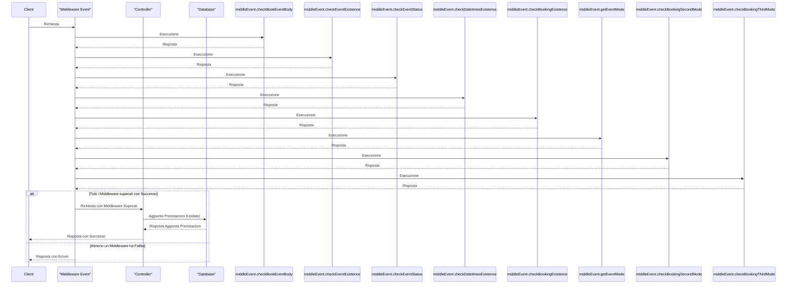

# Progetto Programmazione Avanzata

Il progetto consiste nel realizzare un sistema che consenta di effettuare le prenotazioni di slot temporali similmente al servizio Doodle ( https://doodle.com/it/ ).

## Tabella dei contenuti


## Obiettivi

Lo scopo è realizzare un back-end che consenta di effettuare le prenotazioni di slot temporali similmente al servizio Doodle ( https://doodle.com/it/ ). In particolare,
il back-end deve prevedere che un utente possa effettuare chiamate (payload in JSON) per:

- **[U]** Creare un nuovo evento

- **[P]** Restituire la lista degli eventi associati all’utente distinguendo per eventi aperti e chiusi

- **[U]** Cancellare un evento se non è stata inserita alcuna preferenza

- **[U]** Chiudere un evento, ovvero non consentire più alcuna votazione.

- **[U]** Restituire le prenotazioni associate all’evento.

**[U]** corrisponde ad una rotta autenticata mediante JWT mentre **[P]** è una rotta pubblica.

Ogni utente autenticato ha un numero di token (valore iniziale impostato nel seed del database). Ad ogni creazione avvenuta con successo di un evento si deve decrementare i token associati all’utente considerando i seguenti costi:

- 1 token per Modalità 1

- 2 token per Modalità 2

- 4 token per Modalità 3

Nel caso di token terminati ogni richiesta da parte dello stesso utente deve restituire **401 Unauthorized**.

Prevedere una rotta per l’utente con ruolo admin che consenta di effettuare la ricarica per un utente fornendo la mail ed il nuovo “credito” .


## Diagrammi UML

### Diagramma delle sequenze middleAuthorization

E' la catena di middleware che si occupa di verificare che l'utente sia autenticato e quindi autorizzato. Viene chiamato in ogni operazione, nei prossimi diagrammi verrà indicato come middelAuthorization sottointendo tutti i passaggi qui illustrati. 



### Diagramma prenotazione evento



DATI NEL DB

All'avvi dell'app il database viene populato tramite il file seed html

## Rotte dell'applicazione

Tutte le rotte partono dall'indirizzo http://localhost:3000/api. La seguente tabella riporta tutte le rotte disponibili:

| Rotta                             | Metodo | Autenticazione JWT | Ruolo utente |
|:--------------------------------- |:------:|:------------------:|:------------:|
| /create-event                     | POST   | SI                 | qualsiasi    |
| /show-events                      | GET    | SI                 | qualsiasi    |
| /show-bookings                    | GET    | SI                 | qualsiasi    |
| */show-info-user (non richiesta)* | *GET*  | *SI*               | *admin*      |
| /close-event                      | POST   | SI                 | qualsiasi    |
| /delete-event                     | DELETE | SI                 | qualsiasi    |
| /increment-token                  | POST   | SI                 | admin        |
| /book-event                       | POST   | SI                 | qualsiasi    |

Le rotte che richiedono autenticazione JWT ricevono un token Bearer generato dalla chiave privata inserita nel file .env (di default *progettoProgAgvanzata*). Nelle descrizioni dettagliate delle rotte sono riportati il body in JSON., tralascianod il campo "email" e il campo "role" che fanno riferimento all'utente che effettua la richiesta.

#### Token JWT

```json
{
    "email":"pippo@gmail.com",
    "role":"user"
}
```

### Dettagli rotte

ATTENZIONE! Se il body di ogni richiesta non è ben strutturato (come nei dettagli sotto) viene restituito un errore 422 "Malformed body".

#### Creazione Evento

> **POST** /create-event
> Crea un evento con owner l'utente che ha effettuato la richiesta. Se l'utente non ha token sufficienti l'evento non viene creato (errore )
> 
> ```json
> {
>     "title": "Riunione Mattutina",
>     "datetimes": [ 
>       "2023-07-11 10:00:00+01", "2023-09-15T08:00:00.000Z", "2023-09-15T10:00:00.000Z"
>     ],
>     "mode": 2,
>     "latitude": 43.52555,
>     "longitude": 13.20437,
>     "link": "https://google.it",
>     "bookings": [
>         {
>             "user": "ciccio@gmail.com",
>             "datetimes": ["2023-09-15T08:00:00.000Z"]
>         }
>     ]
> }
> ```

#### Cancellazione evento

> **DELETE** /delete-event
> Cancella un evento se la richiesta viene effettuata dall'owner e se l'evento non ha prenotazioni
> 
> ```json
> {
>   "email": "alessio@gmail.com",
>   "role": "user",
>   "event_id": 6
> }
> ```

#### Eventi di cui un utente è il creatore

> **GET** /show-events
> Visualizza tutti gli eventi di cui l'utente che sta effettuando la richiesta è il proprietario. Non è richiesto un body perchè l'utente viene preso dal token.
> 
> ```json
> {}
> ```

#### Informazioni utente (rotta non richiesta)

> **GET** /show-info-user
> Visualizza tutte le informazioni di un singolo utente. <u>Rotta accessibile solo da utente amministratore</u>
> 
> ```json
> {
>     "user":"alessio@gmail.com"
> }
> ```

#### Prenotazioni effettuate di un evento

> **GET** /show-bookings
> Visualizza tutte le prenotazioni di un singolo evento (di tutti gli utenti).
> 
> ```json
> {
>     "event_id": 3
> } 
> ```

#### Incremento token di un utente

> **POST** /increment-token
> Aumenta i token disponibili in base al numero indicato nel campo "increment_amount". E' un incremento quindi aggiunge i token inseriti a quelli già esistenti, non li sostituisce.
> 
> ```json
> {
>     "increment_amount": 20,
>     "increment_user":"alessio@gmail.com"
> } 
> ```

#### Prenotazione slot evento

> **POST** /book-event
> Prenotazione di slots di un evento. Viene controllata la modalità dell'evento e di conseguenza vengono effettuati i controlli sulla correttezza della prenotazione. Non è possibile mai avere dei doppioni e quindi prenotare due volte lo stesso slot.
> 
> ```json
> {
>     "event_id": 0,
>     "datetimes": ["2023-09-15T10:00:00.000Z"]
> }
> ```


## Installazione ed avvio

### Prerequisiti:

- Docker e Docker Compose
- Git (per clonare la repository, altrimenti si può scaricare direttamente da GitHub)

### Procedura di avvio:

1. Clonare la repository:
   
   ```bash
   git clone https://github.com/alexpaulofficial/progettoProgAvanzata.git
   ```

2. Creare un file .env nella root del progetto con i seguenti campi (modificare a piacimento, soprattutto il campo SECRET_KEY)
   
   ```bash
   SECRET_KEY='' # chiave per generare JWT (progettoProgAvanzata)
   # variabili per database Postgres
   POSTGRES_HOST='db'
   POSTGRES_DB='progettoProgAvanzata'
   POSTGRES_USER='postgres'
   POSTGRES_PASSWORD='password123'
   ```

3. Avviare con Docker Compose:
   
   ```bash
   $ docker compose up
   ```

4. Il servizio è attivo nella porta 3000

## Test

É possibile eseguire una serie di test predefiniti importando la collection Postman situata nella root della repository. I test comprendono vari casi di errore, dall'assenza di token all'impossibilità di prenotare uno slot già prenotato.


## Design Pattern utilizzati

### M(V)C


### Singleton


### Middleware

Il pattern middleware è un design pattern comportamentale utilizzato per gestire richieste e risposte in modo flessibile e modulare. Nel contesto delle applicazioni web, i middleware agiscono come intercettatori tra le richieste dei client e le risposte del server. Ogni middleware esegue una specifica operazione o logica e può decidere di passare la richiesta al successivo middleware nella catena o interrompere la catena e restituire una risposta al client. Questo pattern permette di dividere il flusso delle operazioni in piccoli passaggi indipendenti, facilitando la gestione e la manutenzione del codice.

**Utilizzo della catena di middleware nel progetto:**

Nel progetto specifico che stiamo considerando, la catena di middleware viene utilizzata per effettuare controlli sulla richiesta prima di procedere con l'esecuzione del controller che gestirà l'operazione richiesta dal client.  Se uno dei middleware fallisce nel processo di verifica, la catena interrompe il flusso e restituisce una risposta di errore al client. Se tutti i middleware superano i controlli, la richiesta viene inoltrata al controller che effettua la richiesta al database. 

Questo approccio modulare consente di separare le diverse fasi di controllo della richiesta e favorisce la riutilizzabilità del codice, facilitando inoltre la manutenzione e l'aggiunta di nuovi controlli nel flusso senza dover modificare il core dell'applicazione. Inoltre, rende il codice più leggibile e facile da comprendere, poiché ogni middleware si concentra solo su una specifica operazione logica.

### Chain of Responsability

La Chain of Responsability (CoR) fa parte dei Behavioural Design Pattern e permette di processare una richiesta attraverso l'esecuzione di funzioni collegate tra loro in un determinato ordine. In Express, la CoR è realizzata tramite le funzionalità dei middleware i quali rappresentano i veri e propri anelli della catena.  

Tale pattern è stato utilizzato per filtrare le richieste HTTP in modo da far pervenire al Controller solamente quelle corrette; per ogni rotta è stata definita una catena di middleware composta da:

- middleware per il controllo dell'header e del token JWT (ove necessario);
- middleware specifici della rotta (controllo sui tipi, sull'integrità dei dati, sui vincoli del database...) che restituisco errore dove necessario;

Nel dettaglio, la CoR è implementata nella cartella [middleware](middleware).

### Router


## 📦Tool di sviluppo

- [Node.JS](https://nodejs.org)
- [Express](https://expressjs.com)
- [PostgreSQL](https://www.postgresql.org/)
- [Sequelize](https://sequelize.org) 
- [Docker](https://www.docker.com/)
- [Postman](https://www.postman.com)
- [JWT](https://jwt.io)
