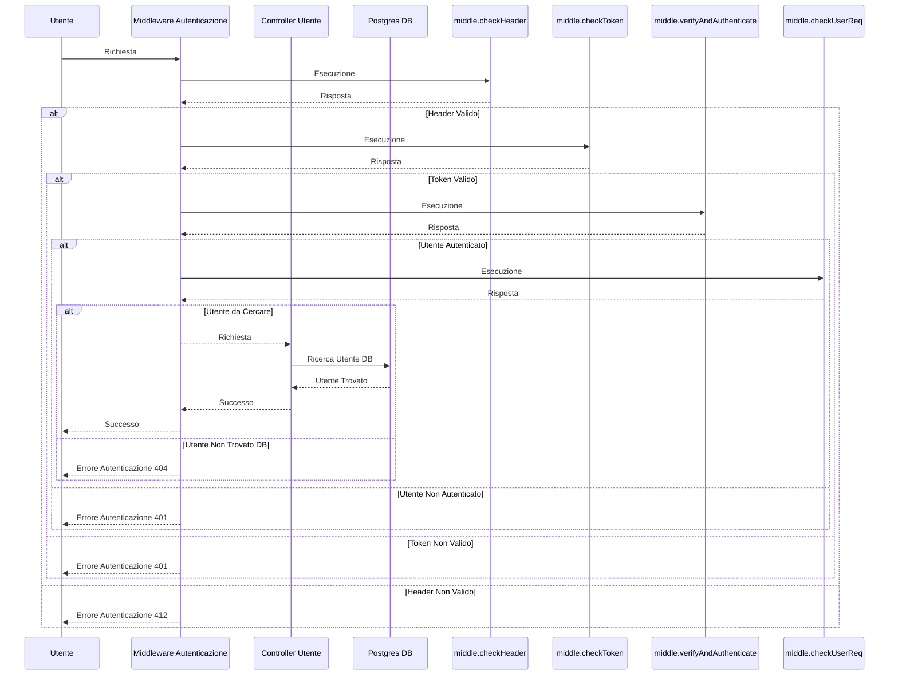
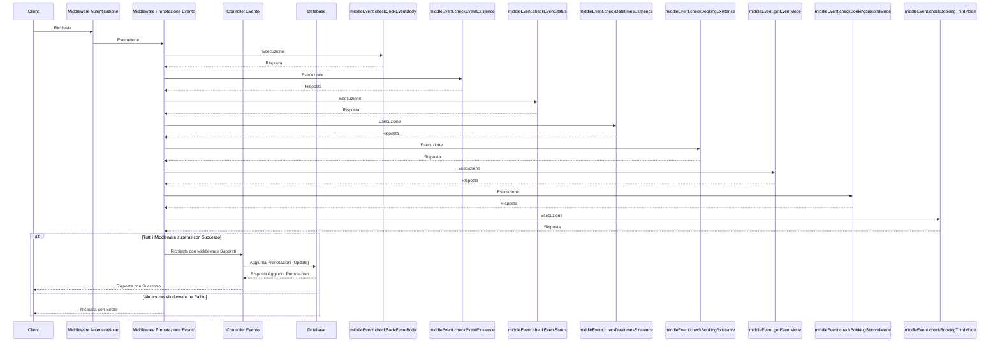

# Progetto Programmazione Avanzata

Il progetto consiste in un'API Express.js per effettuare le prenotazioni di slot temporali di eventi, simile al servizio Doodle ( https://doodle.com/it/ ).

## 📑 Indice

- [Obiettivi](#-obiettivi)
- [Diagrammi UML](#-diagrammi-uml)
- [Database](#database)
- [Rotte applicazione](#%EF%B8%8F-rotte-applicazione)
- [Installazione ed avvio](#-installazione-ed-avvio)
- [Testing](#-testing)
- [Design Pattern Utilizzati](#-design-pattern-utilizzati)
- [Tool di sviluppo](#tool-di-sviluppo)
- [Miglioramenti e sviluppi futuri](#-miglioramenti-possibili-e-sviluppi-futuri)

## 🎯 Obiettivi

Lo scopo è realizzare un back-end che consenta di effettuare le prenotazioni di slot temporali similmente al servizio Doodle ( https://doodle.com/it/ ). In particolare,
il back-end deve prevedere che un utente possa effettuare chiamate (payload in JSON) per:

- Creare un nuovo evento;

- Restituire la lista degli eventi associati all’utente distinguendo per eventi aperti e chiusi;

- Cancellare un evento se non è stata inserita alcuna preferenza;

- Chiudere un evento, ovvero non consentire più alcuna votazione;

- Restituire le prenotazioni associate all’evento.

Tutte le rotte richiedono <u>autenticazione JWT</u>.

Ogni utente autenticato ha un numero di token (valore iniziale impostato nel seed del database). Ad ogni creazione avvenuta con successo di un evento si deve decrementare i token associati all’utente considerando i seguenti costi:

- 1 token per Modalità 1

- 2 token per Modalità 2

- 4 token per Modalità 3

Nel caso di token terminati ogni richiesta da parte dello stesso utente deve restituire **401 Unauthorized**.

Prevedere una rotta per l’utente con ruolo <u>admin</u> che consenta di effettuare la ricarica per un utente fornendo la mail ed il nuovo “credito” .

## 📊 Diagrammi UML

### Diagramma casi d'uso


### Diagramma delle sequenze Admin

### Diagramma delle sequenze Autenticazione

E' la catena di middleware che si occupa di verificare che l'utente sia autenticato. Viene chiamato in ogni operazione, nei prossimi diagrammi verrà indicato come *Middleware Autenticazione* sottointendo tutti i passaggi qui illustrati. 



### Diagramma delle sequenze Prenotazione Evento



## Database

All'avvio dell'app il database viene populato tramite il file [seed.sql](data/seed.sql), con la creazione della tabella User e Event. 

### Tabella Utente

```sql
email VARCHAR NOT NULL,
name VARCHAR NOT NULL,
surname VARCHAR NOT NULL,
role VARCHAR NOT NULL DEFAULT 'user', # o 'admin'
token INTEGER NOT NULL check (token >= 0),
PRIMARY KEY (email)
```

### Tabella Evento

```sql
id SERIAL PRIMARY KEY,
title VARCHAR NOT NULL,
owner VARCHAR NOT NULL REFERENCES "user" (email) ON DELETE CASCADE ON UPDATE CASCADE,
mode INTEGER NOT NULL check (mode between 1 and 3),
datetimes TIMESTAMP WITH TIME ZONE[] NOT NULL,
status INTEGER NOT NULL DEFAULT 1 check (status between 0 and 1),
latitude FLOAT check (latitude between -90 and 90),
longitude FLOAT check (longitude between -180 and 180),
link VARCHAR,
bookings JSONB DEFAULT NULL #Postgres gestisce efficientemente i file JSON
```

Ad ogni tabella corrisponde un Model in Sequelize ([cartella Modelli](model)).

## 🛣️ Rotte applicazione

Tutte le rotte partono dall'indirizzo http://localhost:3000/api. La seguente tabella riporta tutte le rotte disponibili:

| Rotta                             | Metodo | Autenticazione JWT | Ruolo utente |
|:--------------------------------- |:------:|:------------------:|:------------:|
| /create-event                     | POST   | SI                 | qualsiasi    |
| /show-events                      | GET    | SI                 | qualsiasi    |
| /show-bookings                    | GET    | SI                 | qualsiasi    |
| */show-info-user (non richiesta)* | *GET*  | *SI*               | *admin*      |
| /close-event                      | POST   | SI                 | qualsiasi    |
| /delete-event                     | DELETE | SI                 | qualsiasi    |
| /update-token                     | POST   | SI                 | admin        |
| /book-event                       | POST   | SI                 | qualsiasi    |

Le rotte che richiedono autenticazione JWT ricevono un token generato dalla chiave privata inserita nel file *.env* (da creare come indicato in [Installazione ed Avvio](#-installazione-ed-avvio)). Nelle descrizioni dettagliate delle rotte sono riportati il body in JSON. 

Il campo ***email*** e il campo ***role*** fanno riferimento all'utente che effettua la richiesta e si trovano nel <u>payload del token JWT</u>

#### Token JWT

```json
{
    "email":"pippo@gmail.com",
    "role":"user"
}
```

### Dettagli rotte

**ATTENZIONE!** Se il body di ogni richiesta non è ben strutturato (come nei dettagli sotto) viene restituito un *errore **422** Malformed body*.

#### Creazione Evento

> **POST** /create-event
> 
> Crea un evento con owner l'utente che ha effettuato la richiesta (non viene inserito nel body perchè viene preso dal token JWT). Se l'utente non ha token sufficienti per la creazione dell'evento non viene creato (errore 401 come richiesto).
> 
> *<u>Le date di ogni prenotazione vanno inserite singolarmente per evitare errori nella prenotazione, ovvero per ogni slot prenotato aggiungere una booking diversa, sempre strutturata come sotto</u>*
> 
> ```json
> {
>     "title": "Riunione Mattutina",
>     "datetimes": [ 
>       "2023-07-11 10:00:00+01", "2023-09-15T08:00:00.000Z", "2023-09-15T10:00:00.000Z"
>     ],
>     "mode": 2,
>     "latitude": 43.52555,
>     "longitude": 13.20437,
>     "link": "https://google.it",
>     "bookings": [
>         {
>             "user": "ciccio@gmail.com",
>             "datetimes": ["2023-09-15T08:00:00.000Z"]
>         }
>     ]
> }
> ```

#### Chiusura evento

> **POST** /close-event
> 
> Chiude le prenotazioni di un evento, solo se la richiesta viene effettuata dall'owner e se l'evento non ha prenotazioni
> 
> ```json
> {
>   "event_id": 2
> }
> ```

#### Cancellazione evento

> **DELETE** /delete-event
> 
> Cancella un evento se la richiesta viene effettuata dall'owner e se l'evento non ha prenotazioni
> 
> ```json
> {
>   "event_id": 6
> }
> ```

#### Eventi di cui un utente è il proprietario

> **GET** /show-events
> 
> Visualizza tutti gli eventi di cui l'utente che sta effettuando la richiesta è il proprietario (owner). Non è richiesto un body perchè l'utente viene preso dal token JWT
> 
> ```json
> {}
> ```

#### *Informazioni utente (rotta non richiesta)*

> **GET** /show-info-user
> 
> Visualizza tutte le informazioni di un singolo utente. <u>Rotta accessibile solo da utente amministratore</u>
> 
> ```json
> {
>     "user":"alessio@gmail.com"
> }
> ```

#### Prenotazioni effettuate di un evento

> **GET** /show-bookings
> 
> Visualizza tutte le prenotazioni di un singolo evento (di tutti gli utenti, non è necessario esserne il proprietario)
> 
> ```json
> {
>     "event_id": 3
> } 
> ```

#### Aggiornamento token di un utente

> **POST** /update-token
> 
> Sostituisce i token disponibili nell'utente indicato nel campo *update_user* con *update_amount*. <u>Rotta accessibile solo da utente amministratore</u>
> 
> ```json
> {
>     "update_amount": 20,
>     "update_user":"alessio@gmail.com"
> } 
> ```

#### Prenotazione slot evento

> **POST** /book-event
> 
> Prenotazione di slots di un evento. Viene controllata la modalità dell'evento e di conseguenza vengono effettuati i controlli sulla correttezza della prenotazione. Non è possibile mai avere dei doppioni e quindi prenotare due volte lo stesso slot (con lo stesso utente)
> 
> ```json
> {
>     "event_id": 0,
>     "datetimes": ["2023-09-15T10:00:00.000Z"]
> }
> ```

## 🧑‍🔧 Installazione ed avvio

### Prerequisiti:

- Docker e Docker Compose
- Git (per clonare la repository, altrimenti si può scaricare direttamente da GitHub)

### Procedura di avvio:

1. Clonare la repository:
   
   ```bash
   git clone https://github.com/alexpaulofficial/progettoProgAvanzata.git
   ```

2. Creare un file *.env* nella root della cartella del progetto con i seguenti campi (modificare a piacimento, inserendo obbligatoriamente la chiave segreta)
   
   ```bash
   SECRET_KEY='' # chiave per generare JWT (progettoProgAvanzata)
   # variabili per database Postgres
   POSTGRES_HOST='db'
   POSTGRES_DB='progettoProgAvanzata'
   POSTGRES_USER='postgres'
   POSTGRES_PASSWORD='password123'
   ```

3. Avviare con Docker Compose (sempre dalla cartella principale del progetto):
   
   ```bash
   $ docker compose up
   ```

4. Il servizio è attivo nella porta 3000

## ✅ Testing

É possibile eseguire una serie di test predefiniti importando la collection Postman situata nella cartella [testing](/testing). I test comprendono vari casi di errore, dall'assenza di token all'impossibilità di prenotare uno slot già prenotato. Nella rotta non richiesta (show-info-user) non sono stati inseriti test non essendo richiesta, ma comunque la rotta viene controllata ed è stata implementata completamente. 

**<u>Per la generazione del token JWT va dichiarata una variabile globale su Postman della chiave privata che si chiama SECRETKEY</u>**

**ATTENZIONE!** I test danno esito 100% positivo se lanciati appena installato il servizio. Chiaramente se si fanno modifiche ai token degli utenti o si prenotano slot specifici i test potrebbero dare errore se lanciati di nuovo.

## 💡 Design Pattern utilizzati

### M(V)C

Il pattern **MVC (Model-View-Controller)** è un *Architectural Design Pattern*. Esso suddivide l'applicazione in tre componenti distinti: il *Modello* (Model), la *Vista* (View) e il *Controller* (Controller). In questo specifico progetto non sono state implementate Viste, trattandosi di un API solo back-end.

Il Modello rappresenta la *business logic* dell'applicazione ed è responsabile della manipolazione dei dati. Nel progetto ci sono i Modelli delle due entità Utente ed Evento ed il modello Database che definisce l'istanza di Sequelize.

Il Controller funge da intermediario tra vari Middleware ed il Modello. Esso riceve le richieste, già processate dai vari Middleware e le gestisce, chiamando i metodi appropriati nel Modello per elaborare la richiesta e ottenere i dati necessari. Il Controller è responsabile della logica di controllo dell'applicazione, che può includere la validazione dei dati, la gestione degli errori e la gestione del flusso di controllo.

Questa suddivisione favorisce una struttura modulare e mantenibile, senza mescolare la business logic con la logica di presentazione o controllo, favorendo la scalabilità del codice.

### Singleton

Il pattern **Singleton** è un *Creational Design Pattern* utilizzato per garantire che una classe abbia una sola istanza e fornisca un punto di accesso globale a tale istanza. Nel caso specifico del progetto l'istanza di *Sequelize* sarà unica in tutto l'applicativo, e tutte le richieste per accedere al database utilizzeranno la stessa istanza.

Sequelize è utilizzato come *ORM (Object-Relational Mapping)* per gestire le operazioni sul database e poiché è una risorsa costosa da inizializzare e configurare, è desiderabile che venga creato in un'unica istanza e che questa istanza venga appunto condivisa da tutte le parti dell'applicazione che necessitano di accedere al database.

Quando viene richiesto l'utilizzo di Sequelize, l'applicazione verifica se un'istanza è già stata creata in precedenza. Se l'istanza non esiste, ne viene creata una nuova e memorizzata, se invece esiste già, viene restituita quella esistente. Questo contribuisce a una migliore gestione delle risorse e a un codice più pulito e organizzato.

### Chain of Responsability

La **Chain of Responsability (CoR)** è un *Behavioural Design Pattern* e permette di processare una richiesta attraverso l'esecuzione di funzioni collegate tra loro in un determinato ordine. In questo progetto la CoR è realizzata tramite le funzionalità dei [Middleware](#middleware) i quali rappresentano i veri e propri anelli della catena.

Tale pattern è stato utilizzato per filtrare le richieste HTTP in modo da far pervenire al Controller solamente quelle corrette; per ogni rotta è stata definita una catena di Middleware composta da Middleware per il controllo dell'header e del token JWT (ove necessario) oppure da Middleware specifici della rotta (controllo sui tipi, sull'integrità dei dati, sui vincoli del database...) che restituiscono errore dove necessario. 

### Middleware

Il pattern **Middleware** è un *Behavioural Design Pattern* utilizzato per gestire richieste e risposte in modo flessibile e modulare. Le richieste all'API vengono gestite da una serie di funzioni Middleware, ognuna delle quali esegue una specifica operazione logica e può decidere di passare la richiesta al successivo Middleware nella catena tramite *next()* o interrompere la catena e restituire la *res (Risposta)* al client. 

In questo specifico progetto, la catena di Middleware viene utilizzata per effettuare controlli sulla richiesta prima di procedere con l'esecuzione del Controller che gestirà l'operazione richiesta dal client, come indicato in [CoR](#chain-of-responsability).  Se uno dei Middleware fallisce nel processo di verifica, la catena interrompe il flusso e restituisce una risposta di errore al client. Se tutti i Middleware superano i controlli, la richiesta viene inoltrata al Controller che effettua la richiesta al database tramite Model. 

Questo approccio modulare consente di separare le diverse fasi di controllo della richiesta e favorisce la riutilizzabilità del codice, facilitando inoltre la manutenzione e l'aggiunta di nuovi controlli nel flusso senza dover modificare il core dell'applicazione. Inoltre, rende il codice più leggibile e facile da comprendere, poiché ogni Middleware si concentra solo su una specifica operazione.

### Router

Il pattern **Router** è un *Design Pattern* utilizzato per gestire il routing delle richieste in un'applicazione web. Il suo obiettivo principale è organizzare in modo strutturato il flusso delle richieste da parte degli utenti e di inviarle ai gestori appropriati per l'elaborazione. In questo modo, si assicura una gestione efficace delle diverse funzionalità dell'applicazione e una chiara separazione delle responsabilità tra i diversi percorsi.

In Express.js il Router è rappresentato da un oggetto *Router* che funge da modulo di routing autonomo. Esso permette di definire rotte specifiche (definite nel file [routes.ts](/routes/routes.ts)) e associare ad ognuna di esse dei gestori che si occuperanno di rispondere alle richieste in arrivo. L'utilizzo di Router consente una migliore organizzazione del codice, poiché le rotte e i relativi gestori possono essere raggruppati e montati nell'applicazione principale utilizzando il metodo *app.use()* per creare una gerarchia chiara dei percorsi.

Inoltre, sfruttando il pattern Router, è possibile separare la logica di routing in moduli distinti. Questo offre il vantaggio di rendere il codice più modulare, facilitando la manutenibilità e la scalabilità dell'applicazione. I moduli possono gestire funzionalità specifiche o gruppi di rotte correlate, rendendo il codice più leggibile, comprensibile e organizzato.

## 📦Tool di sviluppo

- [Node.JS](https://nodejs.org)
- [Express](https://expressjs.com)
- [PostgreSQL](https://www.postgresql.org/)
- [Sequelize](https://sequelize.org) 
- [Docker](https://www.docker.com/)
- [Postman](https://www.postman.com)
- [JWT](https://jwt.io)
- [Libreria gestione date (Moment.js)](https://momentjs.com/)
- [Libreria risposte HTTP (http-response-status)](https://www.npmjs.com/package/http-response-status)

## 🔮 Miglioramenti possibili e sviluppi futuri

- Introdurre più filtri nella creazione e gestione eventi

- Utilizzo di Builder e Factory sia per generare errori, sia per generare Middleware 

- Front-end

- ...
